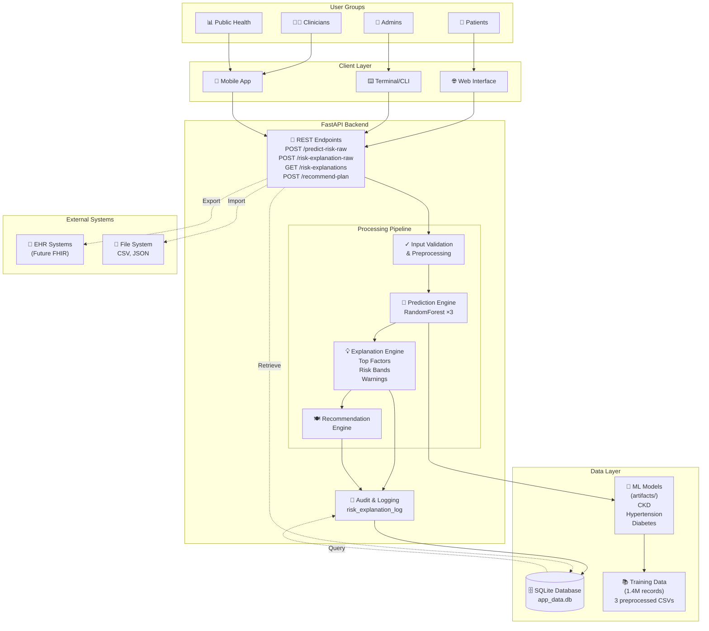
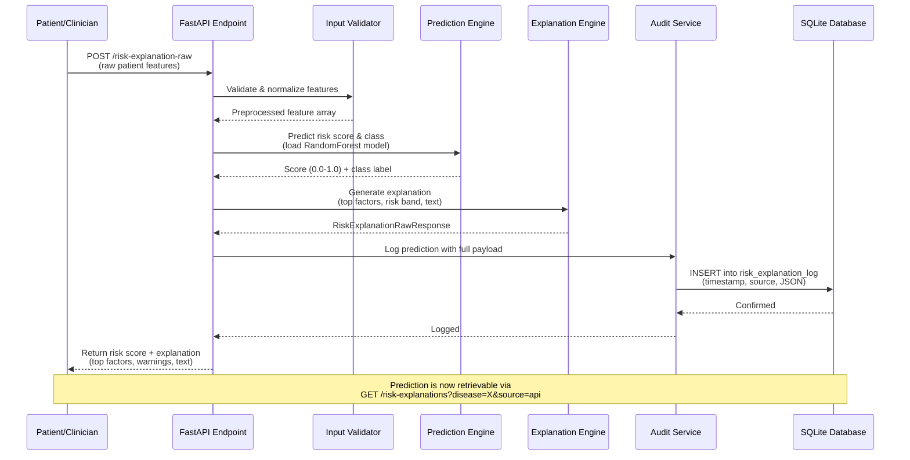
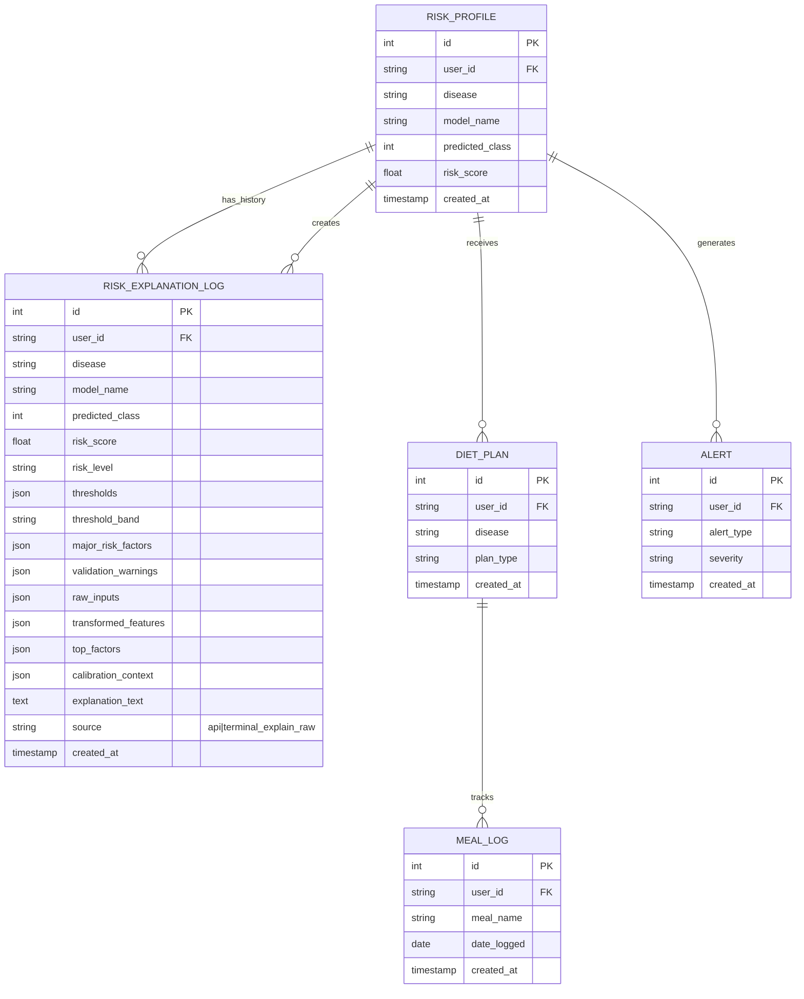
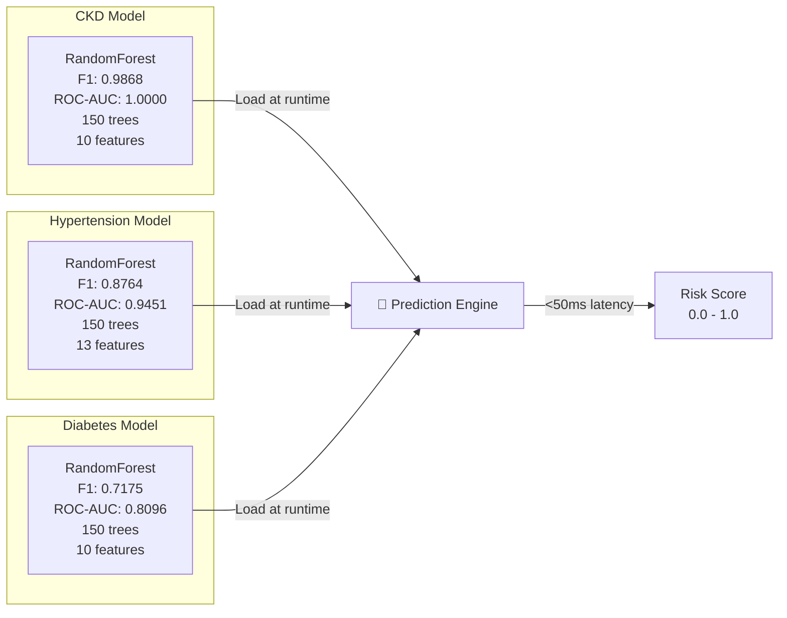
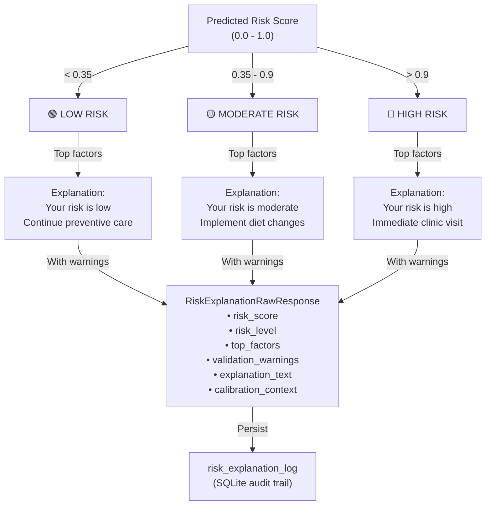
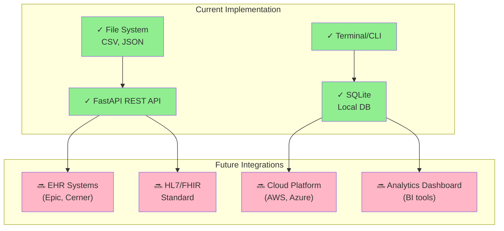
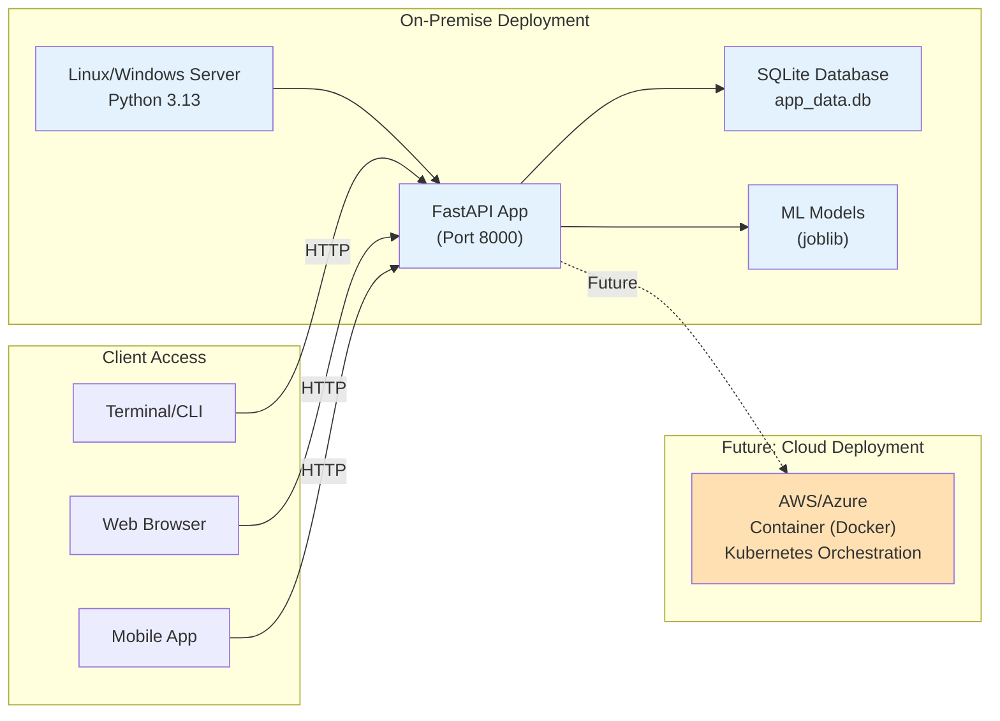
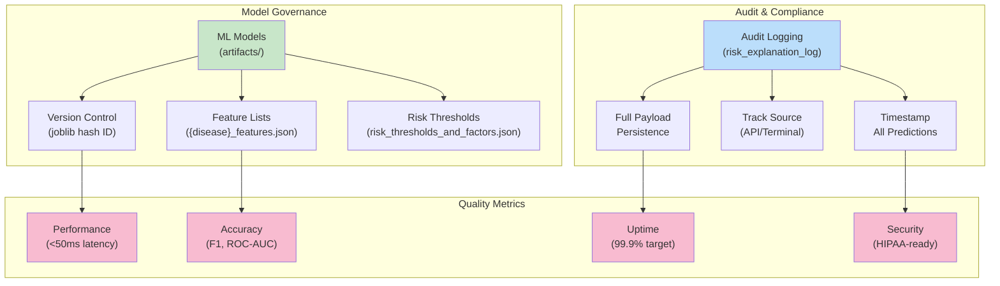

# System Architecture - Mermaid Diagrams

## 1. High-Level Component Diagram

## 2. Data Flow: Explain-Raw Prediction

## 3. Database Schema & Relationships

## 4. Model Performance Comparison

## 5. Risk Scoring & Interpretation

## 6. Integration Architecture (Current & Future)

## 7. Deployment Architecture

## 8. Quality & Governance

---

**Note:** These diagrams complement the detailed SYSTEM_DESIGN_OVERVIEW.md document. Use them for:
- PowerPoint slides (copy-paste Mermaid output or export as PNG/SVG)
- Documentation
- Stakeholder presentations
- Architecture review meetings
